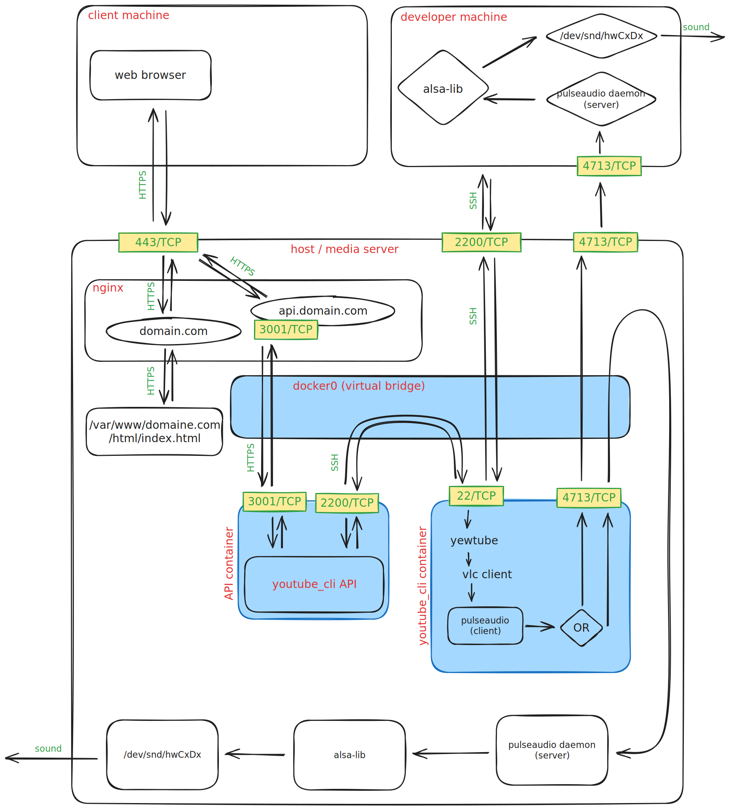

# youtube-remote-for-home-server

**TLDR** : This is a web app that let you play music from a youtube video on your home server. Everything is controlled from a web app GUI.

**WORK IN PROGRESS** : not ready for production

## Caption

- **host** : the machine that runs a container (can be the same or different for both container).
- **API container**: the REST API container that sends SSH commands to the youtube_cli container to control the video.
- **youtube_cli container** : the container that plays the audio but does not output the sound. It sends the audio data to the MEDIA-SERVER trought pulseaudio TCP.
- **media server** : the machine that has the speakers to output sound. It can be the same as the HOST or a different machine.

## How it works ?



This app's REST API sends SSH commands to a container (so called _youtube_cli container_) to control a youtube audio playing on it. It can be used over the internet through a secure SSH connection. Therefore, the API and the youtube_cli container can be on the same host machine or on different machines.

The video is played in the CLI using [yewtube](https://github.com/mps-youtube/yewtube).
Yewtube requires [VLC](https://github.com/videolan/vlc) to play videos.

## Installation

1. Install Docker on the **youtube_cli container's host** follwing the instructions [here](https://docs.docker.com/engine/install/).

2. Generate a pair of SSH keys, following the instructions from the [.private/README.md](app/config/.private/README.md).

3. In the Dockerfile, you will have to modify a few things accordigly to your setup.

   1. Change the passwords for root and youtube_cli user.

   2. Update the value for the `PULSE_SERVER` environment variable with the IP of the media server. You can find the IP by running the correct command among the following on the media server.

   ```bash
   # Media server is the host machine
   ip -4 -o a| grep docker0 | awk '{print $4}' | cut -d/ -f1

   # Media server is a different machine
   ip -o route get to 8.8.8.8 | sed -n 's/.*src \([0-9.]\+\).*/\1/p'
   ```

4. Copy the folder `app/config/docker/*` and the `app/config/.private/ssh_key.pub` file to the desired directory from this repository (probably your local machine) to the host server.

```bash
scp ./app/config/docker/* user@hostname:~/docker-containers/youtube_cli
scp ./app/config/.private/id_ed25519.pub user@hostname:~/docker-containers/youtube_cli
```

5. On the host server, build the Dockerfile.

```bash
docker build -t youtube_cli-image .
```

6. Run the docker image.

```bash
docker run \
  -dit \
  --name youtube_cli-container \
  -p 2200:22 \
  youtube_cli-image
```

We might not need the cookie, but I'm not sure yet. I'll update this section when I'll know more.

7. Grab the container's IP address and save it somewhere.

```bash
docker inspect --format '{{ .NetworkSettings.IPAddress }}' youtube_cli-container
```

8. Install Pulseaudio as a daemon where you want to play the sound. For example, on your host server. You can find the instructions [here](https://wiki.archlinux.org/title/PulseAudio/Examples#PulseAudio_as_a_system-wide_daemon) for Debian based OS.

9. On media server, load Pulseaudio TCP module authenticated with the container's IP address.

```bash
pactl load-module module-native-protocol-tcp port=4713 auth-ip-acl=container_ip_address
```

10. Don't forget to open the necessary ports on your firewall. Check the [firewall section](#firewall-and-port-forwarding) for more details.

## Hints

### Firewall and port forwarding

For some reason, you might want to tunnel the API/container or the container/media-server connection over the internet. In this case, you will have to open and forward the according ports to your server, in each your router admin pannel and your firewall.

SSH port : 2200\
 Pulseaudio port : 4713

### SSH into the container

If you want to access the container shell from your local machine, you can run the following command.

```bash
ssh -i /path/to/private-ssh-key youtube_cli@host-server-hostname -p 2200
```

## Resources

[Pulseaudio doc](https://www.freedesktop.org/wiki/Software/PulseAudio/Documentation/User/Network)

Special thanks to the authors of those resources that helped me **a lot** for this project.

[Container sound : Alsa or Pulseaudio ?](https://github.com/mviereck/x11docker/wiki/Container-sound:-ALSA-or-Pulseaudio)

[Understand how ALSA & Pulseaudio work (with schemas)](https://joonas.fi/2020/12/audio-in-docker-containers-linux-audio-subsystems-spotifyd/)

[architecture schema for device exposing & pulseaudio socket (not TCP)](https://github.com/COMP0016-Team-24/COMP0016-Team-24.github.io/issues/1)

[audio inside container (socket vs network using LXD)](https://discuss.linuxcontainers.org/t/audio-via-pulseaudio-inside-container/8768)

[Uderstand Docker subnets (French)](https://blog.alphorm.com/comprendre-le-reseau-sous-docker/)

[Expose container IP to LAN](https://www.quora.com/Can-a-docker-bridge-network-allocate-LAN-IP-addresses-for-each-container#:~:text=Yes%2C%20Docker's%20bridge%20network%20mode,the%20host%20and%20other%20containers.)

## dev notes : **TODO**

- Install yewtube or use VLC CLI
- Direct request to Youtube API ? [Doc](https://developers.google.com/youtube/v3/docs?hl=fr)
- Setup Git Flow
